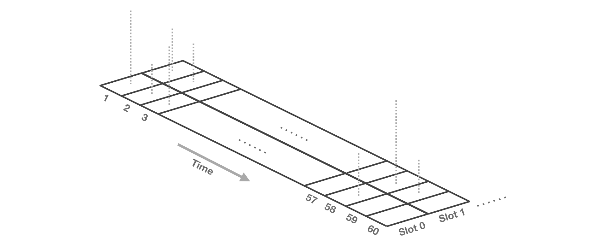
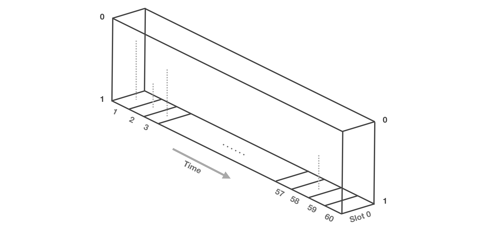

<h1 align="center">Quartz Framework</h1>
<h2 align="center">A Framework for Blockchain Scalability</h2>
<p align="center">
author <a href="mailto:ys.choi@me.com">Yoonsung Choi</a>
</p>

<p align="center">
  <a href="https://github.com/QuartzWorld/Whitepaper"></a>
  <a href="https://github.com/QuartzWorld/Whitepaper/blob/master/LICENSE"></a>
</p>

## Abstract

이 문서는 Blockchain의 초당 Transaction 처리 속도를 극도로 끌어올리며, 경제적인 모델을 도입하여 합리적인 수수료를 지불할 수 있는 Quartz Framework라고 불리는 프로토콜 집합체를 설명하고 있습니다. 이 Framework의 핵심은 투표에 따라 Transaction 처리량이 변동되며 따라서 Validator들이 받게 되는 수수료를 달리 하는 것으로 네트워크를 자율적으로 작동하게끔 합니다.

이 Framework는 Ethereum[[1]](https://github.com/ethereum/wiki/wiki/White-Paper)과 통합되어 Smart Contract의 작동을 병렬적으로 처리하며, Quartz Framework를 통해 파생되는 Network들은 개별적인 Cryptoeconomy를 확립하게 됩니다.


## Background

Blockchain Network는 Block의 용량적 제한 그리고 처리 단위에 대한 제한으로, 전 세계에서 동시 다발 적으로 발생하는 Transaction을 다수 처리할 수 없으며, 그 마저도 Transaction에 포함된 수수료가 높은 순서대로 처리됩니다.

이러한 상황에서 Transaction 처리 비율을 높이기 위해 GHOST Protocol이 도입되지만, 현재의 Proof of Work Consensus 상에서 Transaction을 처리하기 위한 커다란 요인이 되지 못합니다.

Blockchain은 기본적으로 많은 이용자들의 공용 플랫폼입니다. Initial Coin Offering 과 같은 이벤트는 Transaction 수수료가 자연스럽게 상승하게 되는 주 요인이며, 이러한 이벤트에 참여하지 않는 다수의 이용자들은 갑작스럽게 상승한 Transaction 수수료를 따라야 합니다.

Smart Contract의 발전으로 다양한 Token이 Blockchain 상에서 발행 되었으며, Token들은 이용 방법과 가치가 각각 다릅니다. 하지만 이러한 Token을 전송하거나 이용할 때는 주 Blockchain이 제공하는 Coin을 이용하여 Transaction 수수료를 지불하여야 하는 단점이 존재합니다.

이러한 문제들은 최근까지도 지속적으로 이뤄지고 있으며, 이 문서에서는 위와 같은 상황들에 대한 해결 방법이 되고자 작성되었습니다.


## Introduction

Ethereum과 Bitcoin을 비롯하여 Blockchain은 상태를 저장하고, 변경의 기록을 Block에 담아 모든 Peer to Peer 네트워크를 통해 참여자들이 동일하게 가지게 됩니다. 또한 Smart Contract의 발전으로 Blockchain의 상태 변경을 프로그램 할 수 있게 되었고, 이를 통해서 중재자 없는 다양한 서비스들이 세상에 나올 수 있게 되었습니다.

하지만 이 모든 서비스들의 Transaction을 처리하기에는 Blockchain이 수용할 수 있는 초당 Transaction 수가 너무 낮다는 것이 문제입니다. 이러한 Blockchain의 Scalability를 On-chain에서 처리하는 것은 너무 많은 대기 시간을 요구합니다.

보통 Block 보상으로 주어지는 암호화폐를 Coin, Blockchain을 기반으로 만들어진 암호화폐를 Token이라 부르는데, 또한 Decentralized Application(이하 DApp)을 작동 시키기 위해서 Transaction 수수료로 Coin을 사용하게 됩니다.

Network 또는 DApp의 가치는 실질적으로 사용하는 사람들에 의해 결정됩니다. 수수료 보다 낮은 가치를 지닌 Token을 전송하고 사용하는 경우에는 어떨까요? 많은 기능적 이익을 제공하지만, 수수료로 더욱 많은 비용을 지불한다면 가치가 보장되기 어려운 환경이 될 것입니다.

예를 들어 Augur나 Aragon과 같은 DApp은 Ether를 수수료로 지불하여 Token을 사용하도록 하는데, 이는 필수적으로 Ether를 필요로 한다는 문제가 있습니다. 때문에 Transaction은 On-chain이 아닌 Off-chain에서 처리되어야 합니다. 하지만 Off-chain은 State가 저장되지 않고, 암호작업에 많은 리소스를 투입하는 것으로 상태를 유지합니다.

결국이는 다음과 같은 극단으로 나뉘게 됩니다.

* Blockchain을 통해서 전체 State를 간단히 추적하는 방법
* 많은 암호 작업을 통해서 나와 연결된 State의 추적하는 방법

Quartz Framework를 생성된 Network는 기본적으로 Ethereum에 연결되어 있지만, Off-chain으로 작동합니다. 이 네트워크는 각각의 Token 또는 Wrapped Ether(이하 WETH)를 통해서 자율적인 경제 체계를 가지고, 많은 수의 Transaction을 수용할 수 있게 됩니다.

다음과 같은 사용 사례들이 존재할 수 있습니다.

* 법정화폐를 기반으로 하는 Point of Sales System Network
* DApp을 위한 Network Pool
* Multi-Party Computation
* Point 시스템
* 지급 결제
* Ticketing / Ticket Trade Platform
* Private Network


## Quartz Framework

Quartz Framework는 다음과 같은 목적을 위해 연구되었습니다.

- <b> Blockchain for DApp </b> - Ethereum 위에 DApp을 개발하게 되면, DApp의 Transaction은 다른 Transaction과 동등하게 취급되어, 수수료를 많이 담고 있는 순서대로 처리되게 됩니다. 그렇다면 특정 Smart Contract또는 Contract의 집합(DApp)을 위한 Blockchain이 존재한다면, 모든 작동을 해당 DApp을 사용하는 이용자들에게 적용됩니다. 결과적으로 Ethereum은 모든 Transaction을 처리하지 않아도 되므로, 주 Blockchain의 Transaction 수용률이 증가하게 됩니다. 

- <b> 경제적 독립 </b> - 현대의 DApp을 이용하기 위해서는 각 DApp에서 발행한 Token 이외에, 주 Blockchain의 재화를 Transaction 수수료로 지불하여야 합니다. 그러나 Quartz Framework는 ERC-20 기반의 Token을 수수료와 Cryptoeconomy를 가집니다. 네트워크의 이용 수수료는 Token으로 지불하고, Validator들은 이 수수료를 수수하는 것으로 네트워크를 유지하게 됩니다. 이러한 접근 방법은 네트워크의 가치를 판단하는데 유용하며, 좀 더 나은 사용자 경험을 제공합니다.

- <b> 새로운 합의 알고리즘 </b> - 각 DApp의 원활한 작동을 위해서 Transaction 수용률은 높으면 높을 수록 좋습니다. 즉 Transaction 수용률이 높으면 많은 사용자들을 수용할 수 있다는 것과 같습니다. 그러기 위해서 초당 Transaction 처리율(이하 tps)을 극도로 끌어올려야 합니다. 그러기 위해서 새로운 경제 모델을 도입한 새로운 합의 알고리즘에 대한 연구를 필요로 합니다.

- <b> Ethereum의 대량 채택 </b> - 현재의 Ethereum은 모든 Node가 Transaction을 o(c)의 속도로 계산하게 됩니다. 이는 Light Client로 작동하는 IOT Device, Smart Phone에게 배터리나, 연산능력 그리고 Blockchain은 용량에 치명적입니다. 또한 다른 Node를 신뢰하여야 한다는 점 때문에 네트워크의 대역폭을 지속적으로 사용합니다. 이는 Ethereum이 채택되기 어려운 환경이며, 이러한 문제를 해결할 수 있는 방법이 고려되어야 합니다.

위와 같은 이유로 Quartz Framework를 구현하려고 하며, 이는 다음과 같은 기능을 제공하여 최종 사용자에게 극도로 최적화된 사용자 경험을 제공

- <b> Time based Block </b> - 현재 존재하는 많은 Consensus Algorithm은 일종의 대표자를 선출하여 Block을 생성하게 합니다. Quartz Framework는 대표자를 선출하게 하지 않고 이미 물리적으로 존재하며, 비 가역적인 시간을 이용하여 Block을 생성합니다. 모든 참여 Node는 해당 시간 간극만큼 주기적으로 Block을 추적하고 Transaction을 Block에 담게 됩니다. 이는 일종의 Key Block을 생성하고, 이후에 Micro Block을 모으는 Bitcoin-NG[[2]](https://www.usenix.org/system/files/conference/nsdi16/nsdi16-paper-eyal.pdf)와 유사합니다. 다만 Bitcoin-NG의 선출 과정이 시간에 의해 존재하지 않게 되었고, Block은 시간을 표방하기 때문에, 즉각적인 최종성을 획득할 수 있습니다.

- <b> Proof of Stake </b> - Proof of Stake는 Practical Byzantine Fault Tolerance[[3]](http://pmg.csail.mit.edu/papers/osdi99.pdf)의 구현으로 Block에 66.7% 이상의 투표율을 가져야 Block이 최종성을 띠며 네트워크가 공격에 대한 저항성이 생깁니다. 모든 Validator는 시간을 기반으로하는 Block에 투표를 할 뿐이며, 모든 이용자들은 투표 내역에 따라서 Transaction을 개별적으로 처리하게 됩니다.

- <b> Sharding & Light Client </b> - 모든 이용자들은 특정 Smart Contract만을 추적할 수 있으며, Validator가 투표한 내역에 따라서 해당 Smart Contract의 Merkle Root를 가지고, 다른 이용자와 동기화 할 수 있습니다. 이는 이용자가 특정 Transaction만 처리하여야 하는 동기를 제공하며, 모든 Block의 데이터 복제는 이용자들 사이에 분산되어 있습니다.

- <b> Own Cryptoeconomy </b> - 각 DApp을 이용하기 위해서 발행된 Token을 Transaction 수수료로 지불하고, Validator는 수수료를 얻기 위해서 Block에 투표하게 됩니다. Validator는 담보된 Token에 따라 투표권을 얻으며, 전체 투표량에 따라 Transaction이 처리됩니다. 이는 일종의 Transaction 수수료 확률 게임입니다. Transaction을 생성하는 이용자들은 최저한의 수수료를 베팅하고, Validator들은 이 수수료를 취하기 위해서 최대한 투표를 진행하게 됩니다. 투표가 100%에 가까워지면 모든 Transaction의 수수료를 취할 수 있으며, 반대로 투표가 0%에 가깝다면 수수료를 취할 수 없을 것입니다. 만약 Transaction을 빠르게 처리하기 위해서 많은 수수료를 제출할 것이고, 이는 Transaction의 빠른 최종성을 보장하게 됩니다. 이러한 게임은 장기적으로 0과 1로 나뉘는 수수료 확률 게임이 될 것입니다.

- <b> WhiteLabel Software Development Kit </b> - Quartz Framework는 Ethereum상의 ERC-20 Token별로 Network를 생성할 수 있으며, 그에 따라서 Whitelabel SDK들을 제공할 수 있습니다. 이 Whitelabel SDK은 각 Mobile OS별로 제공되며, Transaction 수수료를 네트워크에 배포된 Token으로 지불합니다.


## Time based Block

Quartz Framework의 Block은 시간을 기반으로 생성됩니다. 예를 들어

`t0 = 1533188820`이고, `t1 = 1533188880`일 때, 이 차는 `60` 입니다. Block Interval이 `60`일 때,

`Block N`의 `Block ID`는 다음과 같습니다.

```JavaScript
const BlockN = sha3(1533188820, 1533188880);
// 5be5f4b80c53d318921141c9e754d0fbe79928784a4b3590225d3c4c5c85b2cf
```

이때 `Block N+1`의 `Block ID`는 다음과 같습니다.

```JavaScript
const BlockN1 = sha3(1533188880, 1533188940);
// 8dc244aedf24855a89b4dabfc598110578ab546966a16069ab77856eea7e08e4
```

이는 모든 Node 합의로써, 결정적인 Block Interval에 따라 다음과 같은 결과를 나타낼 수 있습니다.

```JavaScript
const BlockInterval = n;
const t0 = 1533188820;
const t1 = t0 + BlockInterval;
const BlockId = sha3(t0, t1);
```

이는 Bitcoin-NG[[2]](https://www.usenix.org/system/files/conference/nsdi16/nsdi16-paper-eyal.pdf)의 Key Block과 동일한 역할을 하지만, 선출과정을 거치지 않고, 각 시간에 따라서 `Block ID`를 생성합니다.

Transaction의 순서는 다음과 같은 방법으로 결정됩니다. 예를 들어 `Block N`에서 Transaction이 담고 있는 발생 시점의 시간이 `1533188821` 인 경우, `Block N`의 시작 시간인 `1533188820`을 뺀 값으로 Transaction의 순서를 지정하게 됩니다.

```JavaScript
> 1533188821 - 1533188820
1
```

<p align="center">
  
  <br>
  <b> Mempool Overview 1 </b> - Mempool에 Transaction이 발생한 순서대로 포함되어 있습니다.
</p>

<p align="center">
  
  <br>
  <b> Mempool Overview 2 </b> - Mempool의 Transaction이 같은 순서에 중복되는 경우에 병렬적으로 Slot이 생성됩니다.
</p>

<p align="center">
  
  <br>
  <b> Block Overview </b> - Block에 Transaction이 발생한 순서대로 포함되어 있습니다.
</p>


## Proof of Stake

기존의 Proof of Stake는 Practical Byzantine Fault Tolerance[[3]](http://pmg.csail.mit.edu/papers/osdi99.pdf)의 구현으로 전체 투표권으로 환산된 담보금의 66.7% 이상에 해당하는 투표를 받아야 합니다. Quartz Framework의 Proof of Stake는 Validator의 극단적인 투표 참여를 독려하기 위해서 전체 투표율에 따라 수수료의 수수 비율을 달리 하도록 합니다. Quartz Framework의 모든 Transaction은 수수료를 포함하고 있으며, 이는 mempool에서 상대적인 수수료 크기를 가지게 됩니다.

<p align="center">
  
  <br>
  <b> Mempool Overview 3 </b> - Traansaction의 길이는 수수료의 양에 따라 상대적으로 평가됩니다. 수수료가 상대적으로 많으면 높은 길이를, 상대적으로 적으면 낮은 길이를 가집니다.
</p>

모든 네트워크 이용자들은 일정한 담보금을 Smart Contract에 예치하는 것으로 Validator가 될 수 있습니다. Validator들은 전체 담보금에서 백분율화 된 투표권을 가지게 됩니다. 담보된 투표권은 Mempool의 상대적인 수수료 길이와 1:1 대입되며, 투표에 따라 검증될 Transaction 수가 달라집니다. 최대한 많은 투표가 이뤄졌을 때, 많은 Transaction을 수용할 수 있게 됩니다.

<p align="center">
  
  <br>
  <b> Mempool Overview 4 </b> - 그림과 같이 Validator의 투표에 따라 처리 될 Transaction을 선별하게 되며, 모든 Node가 선별된 Transaction을 처리하게 됩니다.
</p>

수수료가 낮거나, 투표율이 수수료 높이에 도달하지 못하여 처리되지 못한 Transaction은 해당 Time Slice에 남아, 처리될 때 까지 대기 상태로 존재합니다. 

Transaction은 Gossip Protocol[[4]](https://dl.acm.org/citation.cfm?doid=41840.41841)을 통해서 모든 Node와 동기화 되는데, `Block Interval * 3`에 달하는 시간을 `Epoch Time`으로 제공하므로, 모든 네트워크 이용자들은 동일한 Merkle Root[[5]](https://link.springer.com/chapter/10.1007%2F3-540-48184-2_32)를 가지게 될 것입니다. 또한 모든 Validator들은 Full Node로 작동하므로, 모든 Transaction을 통한 상태 변경을 가지고 있어야 합니다.

<p align="center">
  
  <br>
  <b> Merkle Root </b> - 여기에서 투표에 따라 수수료가 낮은 Transaction은 포함하지 않고, 상회하는 Transaction만 모든 이용자가 처리하여 Merkle Root를 계산 함.
</p>


## Sharding

Quartz Framework는 배포된 Smart Contract가 Merkle Root[[5]](https://link.springer.com/chapter/10.1007%2F3-540-48184-2_32)를 구성할 수 있도록 합니다. Validator의 투표에 따른 변동적인 Transaction 수용량을 기반으로 Merkle Root가 갱신됩니다. 그래서 모든 네트워크 이용자는 선택한 Smart Contract의 상태나, 특정한 주소의 잔고 상태를 추적할 수 있습니다.

<p align="center">
  
  <br>
  <b> Smart Contract's Merkle Root </b> - Quartz Framework를 통해서 배포된 Smart Contract는 내부적으로 자체적인 Merkle Tree를 가지며, 해당 Smart Contract에 적용되는 Transaction에 따라 Merkle Root가 변경됩니다. Block의 Merkle Root는 배포된 Smart Contract 들의 Merkle Root로 결정됩니다. Block Merkle Root는 Entropy의 증가점이기 때문에, 난수로 사용될 수 있습니다.
</p>

각 Smart Contract에 따라 평가되는 상대적인 수수료 길이가 각각 다르기 때문에 Contract의 연산량에 따라 수수료가 지불되는 양이 다를 수 있습니다.

```JavaScript
// TxHash = keccak256(...);
{
  From: [ Sender Address ],
  To: [ Recipient Address ],
  Value: [ Token Amount ],
  Data: [ EVM Excute code ],
  GasPrice: [ Token Amount ],
  Time: [ Unix Time ],
  Nonce: [ Counter ],
  Sig: [ Signature Data ],
}
```
<p align="center">
  <b> Transaction Structure </b> - Transaction은 다음과 같은 구조로 이뤄져 있습니다. 특이점으로 Unix Time을 사용하며, 이 시간은 현재의 Block Time 보다 과거 또는 미래에 존재한다 하더라도, 무방합니다. 다만 미래의 시간으로 설정된 경우에는, 해당 Transaction이 미래의 시간 이후에 처리 되어야 합니다.
</p>


## Crypto Economy & Whitelabel SDK

모든 최종 사용자들은 개인키와 공개키를 관리하지 않아야하고, Transaction 수수료를 지불하기 위해서 Ether를 소지하지 않아야 합니다. 다만 네트워크를 이용하기 위한 이용료로, 네트워크에 배포된 Token을 수수료로 지불하여야 합니다. Token을 수수료로 지불하는 것은 서비스를 이용하기 위한 당연한 조치입니다.

이용자들은 일정한 수수료를 지불하여 서비스를 이용합니다. Validator들은 최대한의 투표를 통해서 수수료를 얻을 것이기 때문에, Transaction이 아주 소량의 수수료를 지불하더라도 처리될 것입니다.

또한 최종 사용자가 사용하게 될 지갑이나, DApp은 Whitelabel SDK에 의해 기본적인 작동을 모두 처리할 수 있도록 하여 개발자는 로직과 디자인에 신경쓸 수 있도록 할 것입니다.


## Citations
- [[1]](https://github.com/ethereum/wiki/wiki/White-Paper) "Ethereum White Paper" https://github.com/ethereum/wiki/wiki/White-Paper
- [[2]](https://www.usenix.org/system/files/conference/nsdi16/nsdi16-paper-eyal.pdf) "Bitcoin-NG: A Scalable Blockchain Protocol" https://www.usenix.org/system/files/conference/nsdi16/nsdi16-paper-eyal.pdf
- [[3]](http://pmg.csail.mit.edu/papers/osdi99.pdf) "Practical Byzantine Fault Tolerance" http://pmg.csail.mit.edu/papers/osdi99.pdf
- [[4]](https://dl.acm.org/citation.cfm?doid=41840.41841) "Epidemic algorithms for replicated database maintenance" https://dl.acm.org/citation.cfm?doid=41840.41841
- [[5]](https://link.springer.com/chapter/10.1007%2F3-540-48184-2_32) "A Digital Signature Based on a Conventional Encryption Function" https://link.springer.com/chapter/10.1007%2F3-540-48184-2_32
